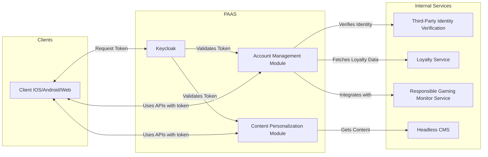

# Player Account Authentication System(PAAS)

## Introduction
The PAAS will consist of 2 SpringBoot Modules integrated with  an IAM solution like Keyckloak.

-   **Authentication (Keycloak):**  
Provides and validates tokens for secure access to the Account Management Module and the Content Personalization Engine.
The MFA flow can be configured in keycloak.
    
-   **Account Management Module:**  
 This module integrates with:
    -   **Third-Party Identity Verification**  for KYC requirements.
    -   **Loyalty Service**  to manage rewards and player loyalty.
    -   **Responsible Gaming Monitor Service**  for player safety and monitoring.
-   **Content Personalization Module:**  
    This engine delivers personalized content to players by getting content from the Headless CMS.
    
Clients interact with both the Account Management Module and Content Personalization Engine using APIs authorized by Keycloak.
    

## High-Level Architecture Diagram


## Authentication Flow Sequences
### Client Authentication 
```mermaid
sequenceDiagram
    participant User
    participant Client
    participant Keycloak

        User->>Client: Prompt Username/Password
    Client->>Keycloak: Initiate authentication (username & password)
    Keycloak->>Keycloak: Verify credentials

        Keycloak->>Client: Respond with MFA challenge (e.g., TOTP/SMS prompt)
        Client->>User: Prompt for MFA code
        User->>Client: Provide MFA code
        Client->>Keycloak: Submit MFA code
        Keycloak->>Keycloak: Validate MFA code
        Keycloak->>Client: Return access token (JWT)
        Client->>Module: Call API with token
        Module->>Keycloak: Validate token
        Module->>Client: Api Response


 ```
 

## Interface Agreements

### API Contract Between Content Personalization Module and Headless CMS
| **Aspect**         | **Details** |
|--------------------|-------------|
| **Base URL**       | `http://cms.internal/api/v1` |
| **Authentication** | None (Internal)|
| **Data Format**    | JSON |
| **Versioning**     | The API is versioned (e.g., `/api/v1/`).  |

#### Endpoints

### 1. Retrieve Personalized Content

| **Field**           | **Details** |
|---------------------|-------------|
| **Endpoint**        | `/content/personalized` |
| **Method**          | GET |
| **Description**     | Fetches a list of promotional content tailored to a user's preferences and behavior. |
| **Parameters**      | **Query Parameters:** <br> - `userId` (required, string): Unique identifier for the user. <br> - `lang` (optional, string): Language code (es. `en`, `es`). <br> - `preference` (optional, string): Filter by content preference (es. promotions, news). |
| **Sample Request**  | <pre><code class="http">GET http://cms.internal/api/v1/content/personalized?userId=12345&lang=en&preference=blackjack
| **Sample Response** | <pre lang="json">{&#13;  "status": "success",&#13;  "data": ["promo"... &#13;  ]&#13;  &#13; }</pre>


#### Error Handling

| **HTTP Status Code**   | **Description**                                         | **Example Response** |
|------------------------|---------------------------------------------------------|----------------------|
| **200 OK**             | Request succeeded.                                      | *N/A – See sample responses above.* |
| **400 Bad Request**    | Malformed request or missing required parameters.       
| **404 Not Found**      | Requested content does not exist.                       
    
---

### API Contract Between Account Management Module and -   Loyalty Program Service
| **Aspect**         | **Details** |
|--------------------|-------------|
| **Base URL**       | `http://loyalty.internal/api/v1` |
| **Authentication** | None (Internal)|
| **Data Format**    | JSON |
| **Versioning**     | The API is versioned (e.g., `/api/v1/`).  |

#### Endpoints

### 1. Retrieve Rewards

| **Field**           | **Details** |
|---------------------|-------------|
| **Endpoint**        | `/content/rewards` |
| **Method**          | GET |
| **Description**     | Fetches a list of rewards achieved by the user. |
| **Parameters**      | **Query Parameters:** <br> - `userId` (required, string): Unique identifier for the user. <br> 
| **Sample Request**  | <pre><code class="http">GET http://loyalty.internal/api/v1/content/reward?userId=12345
| **Sample Response** | <pre lang="json">{&#13;  "status": "success",&#13;  "data": ["rewards"... &#13;  ]&#13;}</pre>


#### Error Handling

| **HTTP Status Code**   | **Description**                                         | **Example Response** |
|------------------------|---------------------------------------------------------|----------------------|
| **200 OK**             | Request succeeded.                                      | *N/A – See sample responses above.* |
| **400 Bad Request**    | Malformed request or missing required parameters.       
| **404 Not Found**      | Requested content does not exist.                       
    
---
### API Contract Between Account Management Module and -   Responsible Gaming Service
| **Aspect**         | **Details** |
|--------------------|-------------|
| **Base URL**       | `http://responsible.internal/api/v1` |
| **Authentication** | None (Internal)|
| **Data Format**    | JSON |
| **Versioning**     | The API is versioned (e.g., `/api/v1/`).  |

#### Endpoints

### 1. Retrieve Rewards

| **Field**           | **Details** |
|---------------------|-------------|
| **Endpoint**        | `/content/responsible` |
| **Method**          | GET |
| **Description**     | Fetches a list of responsible gaming parameters of the user. |
| **Parameters**      | **Query Parameters:** <br> - `userId` (required, string): Unique identifier for the user. <br> 
| **Sample Request**  | <pre><code class="http">GET http://loyalty.internal/api/v1/content/reward?userId=12345
| **Sample Response** | <pre lang="json">{&#13;  "status": "success",&#13;  "data": ["parameters"... &#13;  ]&#13;}</pre>


#### Error Handling

| **HTTP Status Code**   | **Description**                                         | **Example Response** |
|------------------------|---------------------------------------------------------|----------------------|
| **200 OK**             | Request succeeded.                                      | *N/A – See sample responses above.* |
| **400 Bad Request**    | Malformed request or missing required parameters.       
| **404 Not Found**      | Requested content does not exist.                       
    
---

## Implementation Timeline

```mermaid
gantt
    dateFormat  YYYY-MM-DD
	axisFormat %m
    title PAAS Project Implementation Timeline

    section PAAS Team
    Analysis                        :active,     paas_analysis, 2025-03-01, 15d
    Impl                  :   paas_impl,     2025-03-16, 20d
    SIT - Loyalty Integration  :crit,     paas_sit_rg,   2025-04-07, 10d
    SIT - CMS Integration           :crit,     paas_sit_cms,  2025-04-17, 10d
    SIT - Responsible Gaming Integ.      :crit,     paas_sit_loyalty, 2025-04-27, 10d
    Final Testing                   :       paas_testing,  2025-05-06, 10d

    section Responsible <br> Gaming Team
   
    Impl                  :crit,   rg_impl,       2025-03-01, 25d
    SIT                             :crit,     rg_sit,        2025-04-27, 5d

    section CMS Team

    SIT                             :crit,     cms_sit,       2025-04-17, 5d

    section Loyalty Team

    SIT                             :crit,     loyalty_sit,   2025-04-07, 5d

```

## Risk Assessment


### 1. Security Risks

| **Risk**                             | **Description**                                                                                         | **Mitigation Strategy**                                                                                                                                         |
|--------------------------------------|---------------------------------------------------------------------------------------------------------|-----------------------------------------------------------------------------------------------------------------------------------------------------------------|
| Unauthorized Access / Data Breach    | Potential for unauthorized access to sensitive user data due to vulnerabilities in authentication.      | - Use robust multi-factor authentication with Keycloak. <br> - Implement strict role-based access control (RBAC). <br> - Conduct regular security audits.     |
| Data Leakage / Insecure Transmission | Interception of sensitive data during transmission or improper storage can lead to data leakage.           | - Enforce HTTPS/TLS for all communications. <br> - Encrypt sensitive data both in transit and at rest. <br>  |
| Injection Attacks                    | Risk of SQL injection, command injection, or similar attacks via API endpoints.                           | - Validate and sanitize all user inputs. <br> - Use prepared statements and ORM frameworks. <br> - Perform periodic penetration testing.                      |

---

### 2. Compliance Risks

| **Risk**                         | **Description**                                                                                                  | **Mitigation Strategy**                                                                                                                                                    |
|----------------------------------|------------------------------------------------------------------------------------------------------------------|----------------------------------------------------------------------------------------------------------------------------------------------------------------------------|
| KYC/AML Non-Compliance           | Failure to meet Know Your Customer (KYC) or Anti-Money Laundering (AML) regulations may result in legal issues.    | - Integrate with an accredited third-party identity verification service. <br> - Maintain detailed audit logs. <br> - Conduct periodic compliance reviews.         |
| Data Privacy & GDPR Violations   | Inadequate handling of personal data may lead to non-compliance with data privacy regulations (e.g., GDPR).         | - Implement strict data access controls and encryption measures. <br> - Provide clear data consent policies. <br> - Regularly perform privacy impact assessments. |

---

### 3. Third-Party Dependencies

| **Risk**                              | **Description**                                                                                                       | **Mitigation Strategy**                                                                                                                                                      |
|---------------------------------------|-----------------------------------------------------------------------------------------------------------------------|------------------------------------------------------------------------------------------------------------------------------------------------------------------------------|
| Third-Party Identity Verification     | Downtime or security vulnerabilities from the third-party identity verification service could impact operations.         | - Establish SLAs and monitor the service status continuously. <br> - Implement fallback mechanisms to handle temporary outages.                                             |
| Loyalty Service/API Downtime          | Dependency on external APIs (e.g., Verification service) may cause disruptions if the service is unavailable or slow.         | - Implement retry and circuit breaker patterns. <br> - Cache essential data locally where possible.                                                                         |
| CMS & Responsible Gaming Service Changes | Updates or downtime in the CMS or Responsible Gaming Monitor Service may disrupt content delivery or compliance monitoring. | - Maintain versioning and conduct compatibility testing for third-party integrations.  |

---
